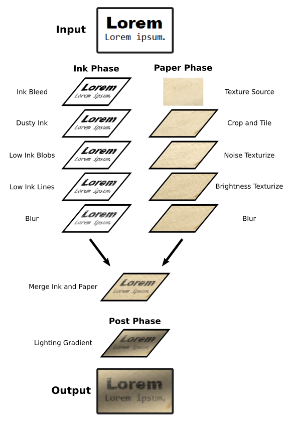
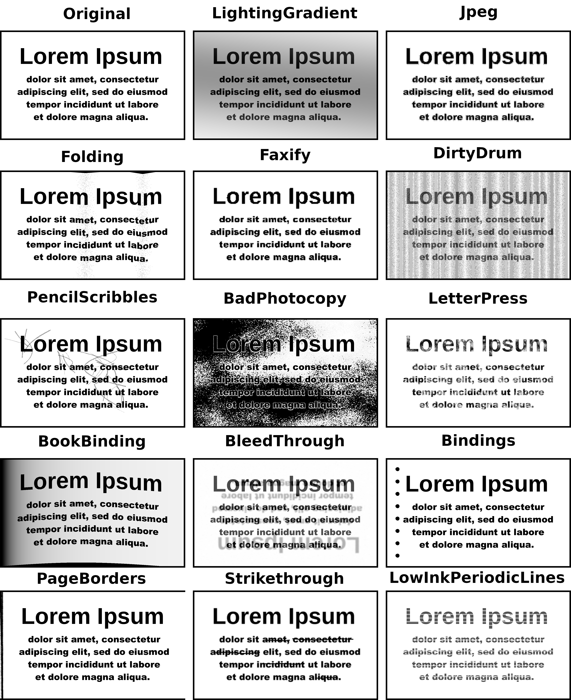

Augraphy
========

Augraphy is a Python library that creates multiple copies of original documents though an augmentation pipeline that randomly distorts each copy -- degrading the clean version into dirty and realistic copies rendered through synthetic paper printing, faxing, scanning and copy machine processes.

Highly-configurable pipelines apply adjustments to the originals to create realistic old or noisy documents by acting as a factory, producing almost an infinite number of variations from their source.  This simulation of realistic paper-oriented process distortions can create large amounts of training data for AI/ML processes to learn how to remove those distortions.

Treatments applied by Augraphy fabricate realistic documents that appear to have been printed on dirty laser or inkjet printers, scanned by dirty office scanners, faxed by low-resolution fax machines and otherwise mistreated by real-world paper handling office equipment.

:How It Works:

Augraphy's augmentation pipeline starts with an image of a clean document.  The pipeline begins by extracting the text and graphics from the source into an "ink" layer.  (Ink is synonymous with toner within Augraphy.)  The augmentation pipeline then distorts and degrades the ink layer.

A paper factory provides either a white page or a randomly-selected paper texture base.  Like the ink layer, the paper can also be processed through a pipeline to further provide random realistic paper textures.

After both the ink and paper phases are completed, processing continues by applying the ink, with its desired effects, to the paper.  This merged document image is then augmented further with distortions such as adding folds or other physical deformations or distortions that rely on simultaneous interactions of paper and ink layers.

The end result is an image that mimics real documents.

:Example Before / After Images:

.. toctree::
   :maxdepth: 2
   :Contents:
   
   contents/installation/installation
   contents/example_basic/example_basic
